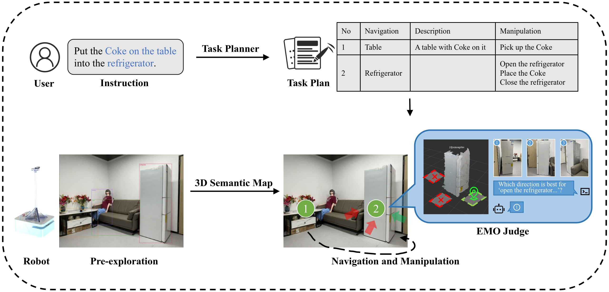
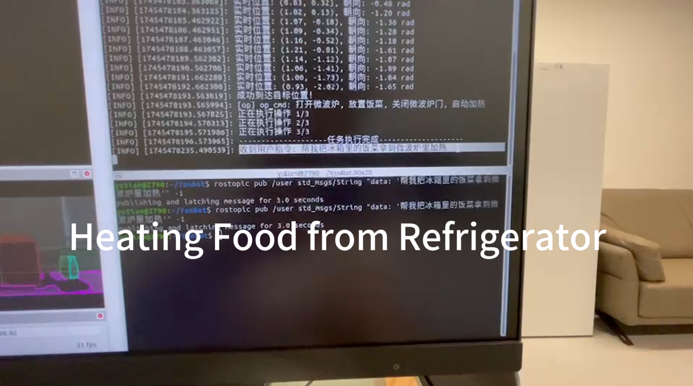
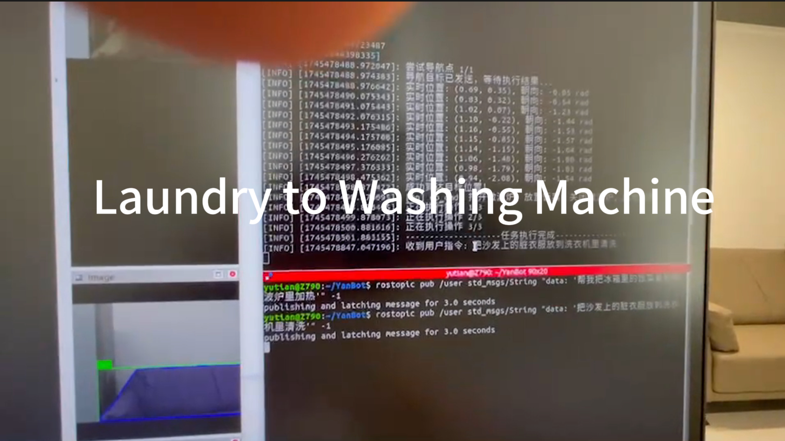

# EMO-MAN: Embodied Manipulation-Oriented Mapping and Navigation

  

Official implementation of **EMO-MAN** 

## Demo Videos
### Task 1: Heating Food from Refrigerator

### Task 2: Laundry to Washing Machine

*Note: Manipulation actions are simulated - robot navigates to pre-defined interaction positions without physical grasping mechanism.*

## Code Availability
The full implementation will be open-sourced after paper acceptance. For research collaboration or early access requests, please contact the corresponding author.

## Contact
**Corresponding Author**  
Mengyuan Liu  
State Key Laboratory of General Artificial Intelligence  
Peking University, Shenzhen Graduate School  
📧 liumengyuan@pku.edu.cn
